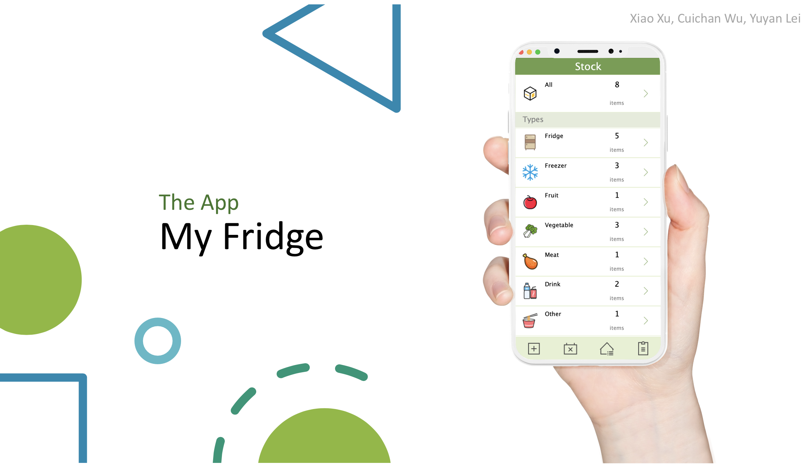
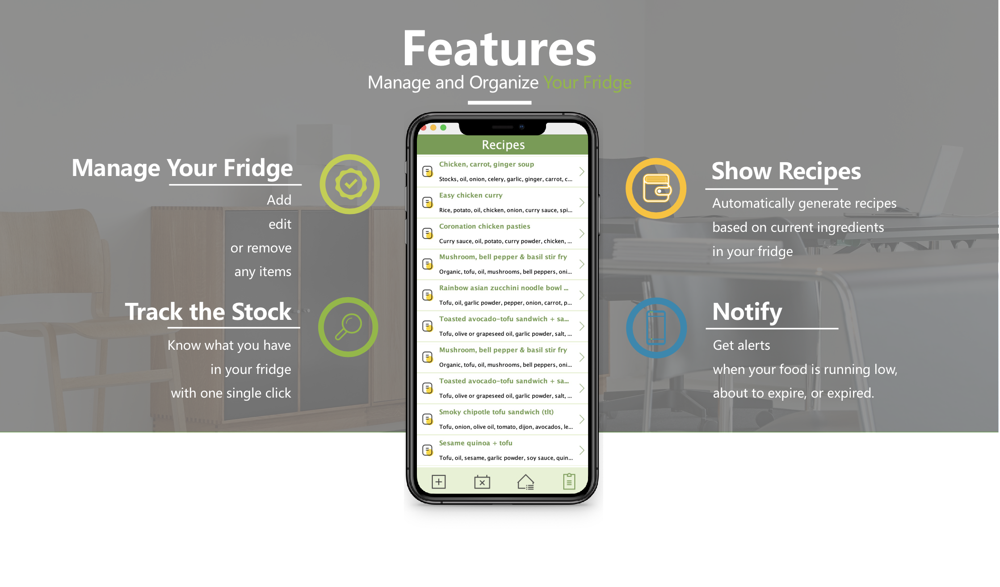
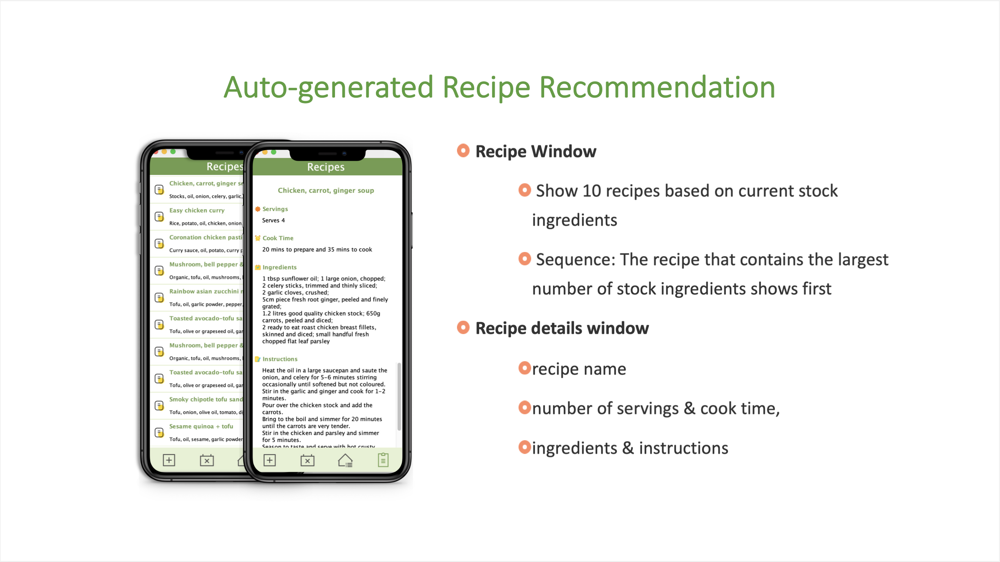
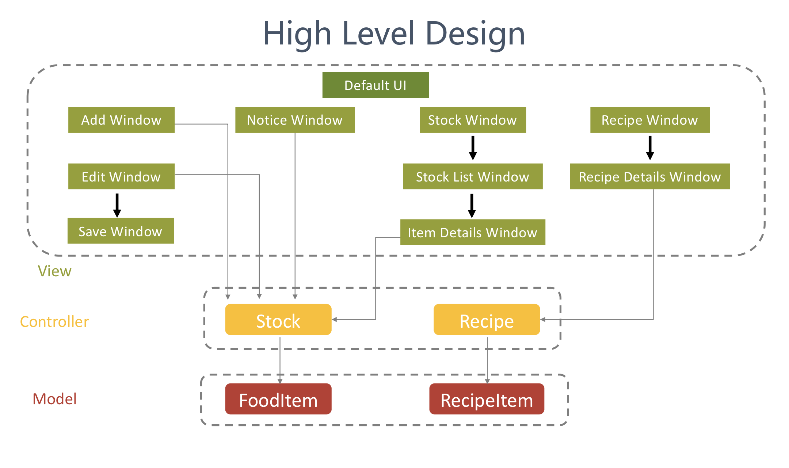

This is the final project of NEU CS 5004 course.

# My Fridge

My fridge is an inventory management system that helps the users to track the stock, get expiration and low stock alerts, and generate recipes. It's supposed to address the issue that people are always wondering about what's in the fridge, when are the foods going to be expired and what can I cook today.

## Features

There are four main features:
- Fridge stock management: allows the user to create, update and remove the items in the fridge.
- Track the stock: tracks the amount and the expiration date of all the items in the fridge based on categories (fruit, meat, freezer, ...).
- Notifications: alerts the user that specific food is running low or is about to expire.
- Recipe generation: based on built-in recipes, it lists all the possible recipes according to how much ingredients the user has in the fridge.

## High Level Design

This application is built with MVC architecture. All of the views communicate with two major controllers: stock controller and recipe controller. The controllers then talk to each database accordingly.

